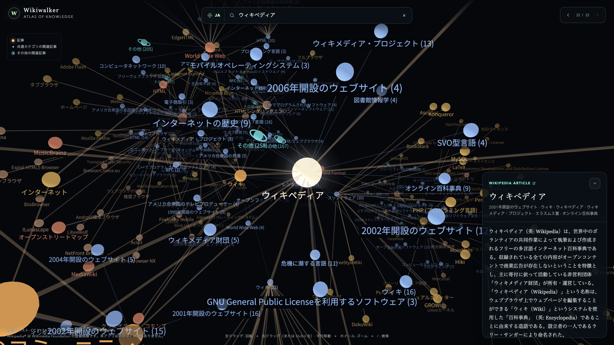

# Wikiwalker

Wikipedia 宇宙の中を「記事星」を辿って散策するグラフィカルブラウザー。

記事を 3D 空間に恒星として配置し、意味的に近い記事、本文からの出リンク、その記事を参照している被リンクを辿りながら知識のつながりを眺められます。大量のリンク先は共有カテゴリごとに「惑星」としてまとめ、その恒星の軌道に並べます。どのカテゴリにも入らない関連記事は環のある惑星になります。

動作確認用のサンプルページを [こちら](https://ura14h.github.io/Wikiwalker/) に用意しています。お試しください。

## 使い方

`index.html` をブラウザーで開くだけです。ビルドもローカルサーバーも不要です（外部ライブラリと Wikipedia API の取得にインターネット接続が必要）。

- 初期画面の中央にある検索欄に記事名を入力して候補から選ぶと、その記事を起点に探索が始まります（検索欄は以後、画面上端に移ります）
- 恒星（記事）の上でマウスを止めると、定義文と「なぜ隣にあるか」を示す覗きカードが浮かびます
- 恒星や惑星（関連記事のまとまり）をクリックすると選択・展開できます。記事は右側のシートで導入部と節構成を読め、畳むと右端のつまみになります
- ドラッグで回転、右ドラッグ（または Shift＋ドラッグ）で平行移動、ホイールでズーム、戻る / 進むで履歴を移動します
- 着陸シートの最下段に、集約したカテゴリ数、その他の関連記事数、出リンク数、被リンク数が表示されます
- 言語ボタンから Wikipedia の言語版を切り替えられます

## 構成

| パス | 内容 |
| --- | --- |
| `index.html` | アプリ本体（単一 HTML、バニラ JavaScript） |
| `docs/` | コンセプト、ストーリーボード、設計仕様書、参考資料 |
| `proto/` | 開発過程のプロトタイプと AI エージェント間のチャットログ |

外部ライブラリは [three.js](https://threejs.org/)、[3d-force-graph](https://github.com/vasturiano/3d-force-graph)、[three-spritetext](https://github.com/vasturiano/three-spritetext) を esm.sh から読み込んでいます。

## 表示するデータについて

記事の内容は [Wikipedia](https://www.wikipedia.org/) の API から取得しています。記事本文は [CC BY-SA 4.0](https://creativecommons.org/licenses/by-sa/4.0/) で提供されており、Wikipedia はウィキメディア財団の登録商標です。本アプリはウィキメディア財団とは無関係です。

API への要求は 1 本の直列キューを通し、[Wikimedia の利用制限](https://www.mediawiki.org/wiki/Wikimedia_APIs/Rate_limits)に対して余裕のある間隔（対話的な要求は 320ms、背景の収集は 650ms）で送信します。被リンクは全数ではなく無作為標本（100 件）だけを取得します。

## ライセンス

MIT License。詳細は [LICENSE](LICENSE) を参照してください。
