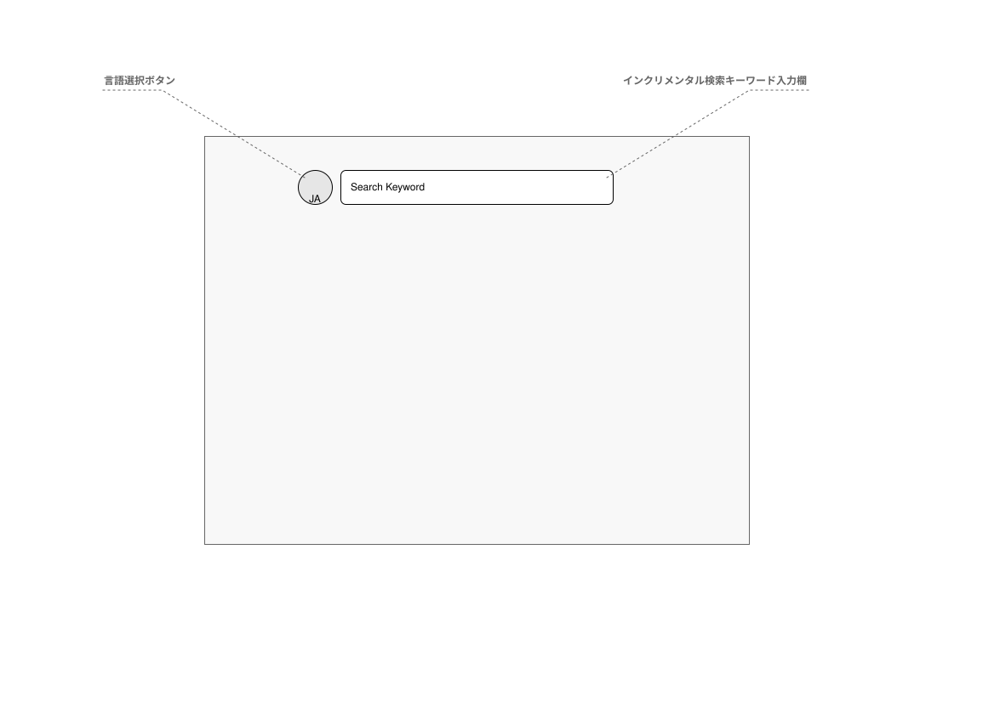
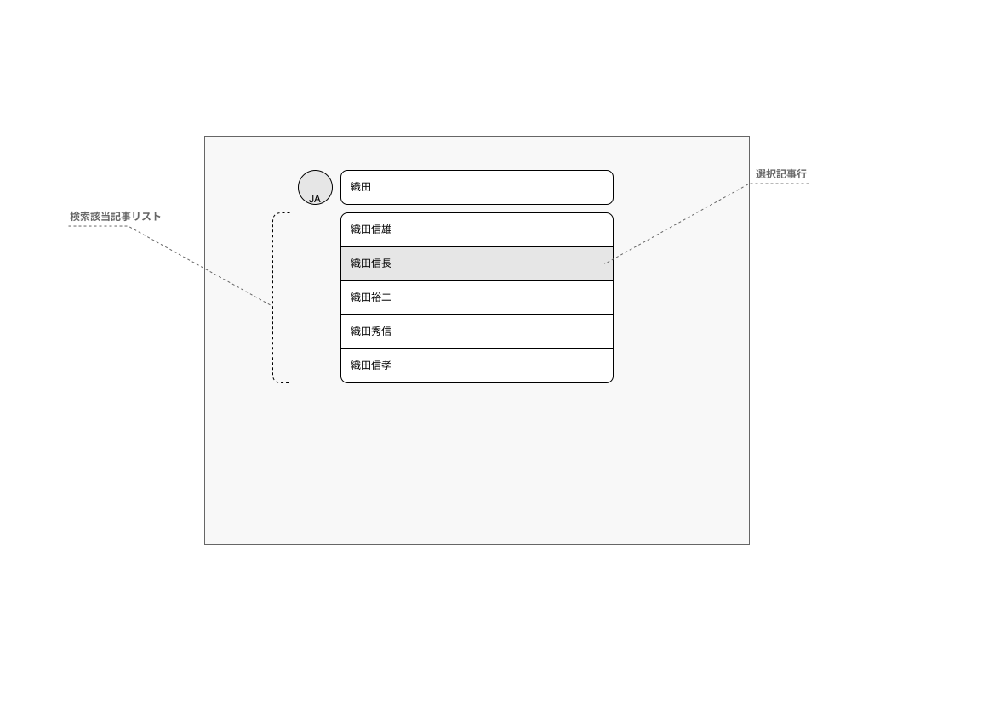
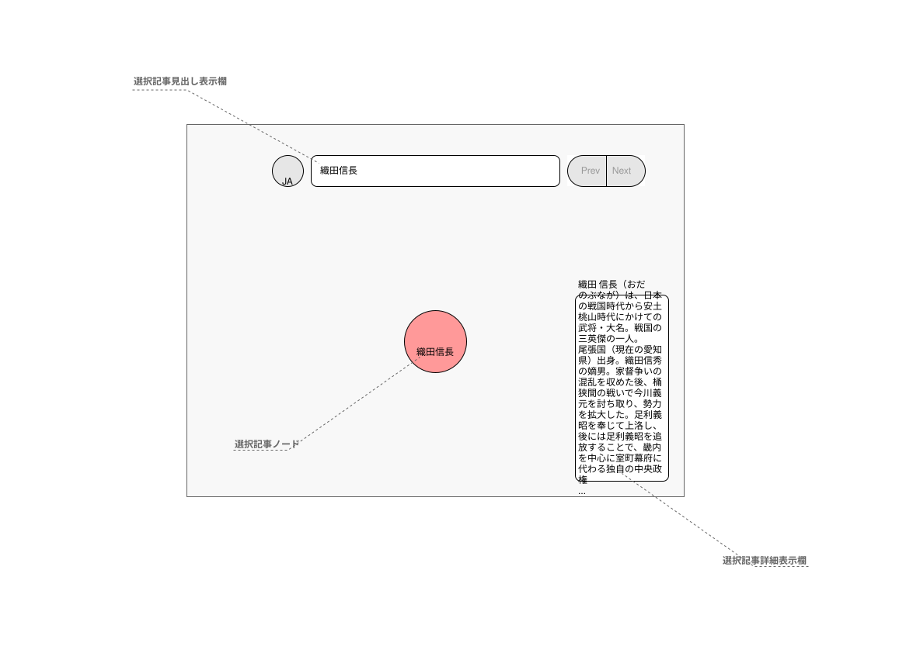
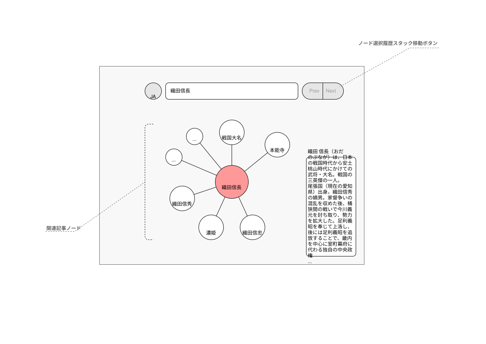
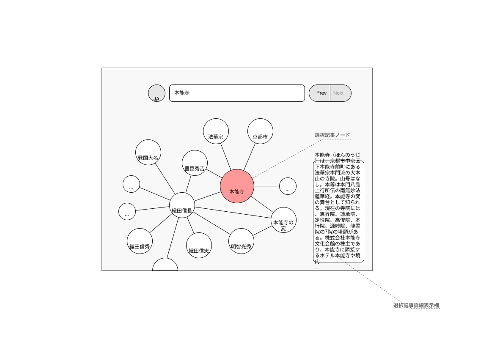

# アプリのストーリーボード

本アプリケーションの画面表示内容と場面遷移の様子について簡単に説明する。

## 場面 #1

初期表示の場面。

- 言語選択ボタン
  - ボタンの見出しに現在選択している言語が表示される。
  - ボタンをクリックすると、Wikipediaの言語選択と同様に、ダイアログがポップアップ表示され表示言語を切り替えられる。
- インクリメンタル検索キーワード入力欄
  - 文字を入力すると、Wikpediaの記事検索と同様に、入力した文字に該当する選択候補が逐次検索され、さらに文字を入力すると検索結果は絞られる。
  - **場面 #2** を参照のこと。

## 場面 #2

Wikipediaの検索キーワードを入力した場面。

- 検索該当記事リスト
  - Wikpediaの記事検索と同様に、インクリメンタル検索の結果がキーワード入力欄のすぐ下にリスト形式でポップアップ表示される。
- 選択記事行
  - 上下カーソルキーで選択を移動させEnterキーを押すかマウスでクリックすると、対象の記事を選択したとみなす。
  - グラフノードを初期化して **場面 #3** へ遷移する。

## 場面 #3

検索キーワードに該当した記事を選択した直後の場面。

- 選択記事見出し表示欄
  - インクリメンタル検索キーワード入力欄に選択した記事の見出しが設定される。
  - このタイミングでもインクリメンタル検索は可能。
- 選択記事ノード
  - 画面中央に選択した記事の見出しをもつグラフノードが表示される。
  - 選択した記事に関連する記事はバックグラウンドで収集が始まる。
  - 各関連記事の取得が完了次第、リアルタイムで表示に反映されていく。**場面 #4** を参照のこと。
- 覗きカード
  - 記事星の上でマウスを止めると、星のそばに小さなカードが浮かぶ。何の記事か（定義文）と、なぜ隣にあるか（関係）が一息で分かる。
  - 通り過ぎただけでは出ない。興味が薄い記事はここで満足して次へ歩ける。
- 着陸シート（選択記事詳細表示欄）
  - 記事星をクリックすると、画面の右側に読み物の柱として開く。導入部の全文と、この先の節の一覧が読める。
  - 畳むボタンで右端のつまみに退き、つまみを押せばまた開く。星図を触っても勝手には閉じない。
- ノードの背景
  - マウスのドラッグでノードグラフを回転できる。
  - SHIFTキーを押しながらマウスのドラッグで、ノードグラフを平行移動できる。

## 場面 #4

関連記事を背後で自動的に取得し表示を逐次更新している場面。

- 関連記事ノード
  - 取得した関連記事は選択した記事の周辺にグラフノードとして表示される。
  - 選択記事のノードと関連記事のノードは関係線で接続される。
  - 選択記事のノードをマウスでクリックすると、それが選択記事になる。**場面 #5** を参照のこと。
- ノード選択履歴スタックボタン
  - Prevボタンをクリックすると、直前に選択した記事が選択される。
  - Prevボタンは、これ以上戻れない場合にクリック無効になる。
  - Nextボタンをクリックすると、Prevボタンで戻ってきた元の記事が選択される。
  - Nextボタンは、これ以上進めない場合にクリック無効になる。

## 場面 #5

選択記事を変更した場面。

- 選択記事ノード
  - 選択したノードが中央に表示される。ノードグラフは初期化しない。
  - 選択ノードが変更された後の振る舞いは、**場面 #3**と**場面 #4**を参照のこと。
- 選択記事詳細表示欄
  - 選択したノードの記事の詳細が表示される。
